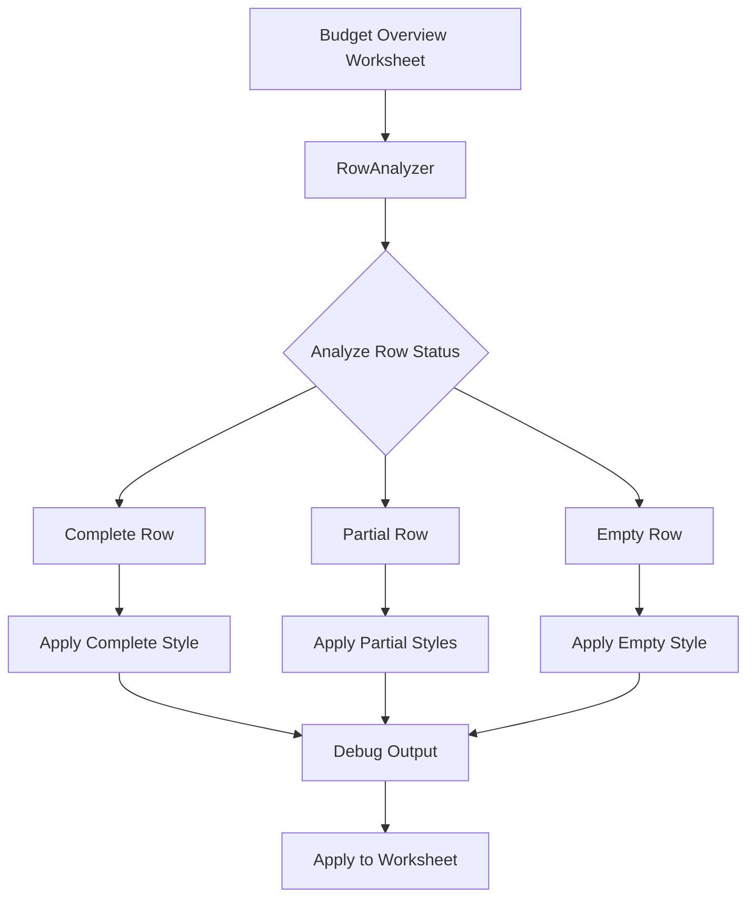

# Budget Overview Styling Design

## Overview

This document outlines the design for `budget_overview_format.py`, a module that applies conditional formatting to the Budget Overview worksheet based on row completion status. The styling is applied after the `update_budget_overview_handler.py` completes its formula updates.

## Requirements

1. **Complete Rows**: All cells filled → Apply full completion style
2. **Partial Rows**: Some cells filled → Different colors for filled vs empty cells  
3. **Empty Rows**: No cells filled → Apply empty row style
4. **Debug Output**: Show detailed information about what styles will be applied
5. **Integration**: Apply styles after formula handler completes

## Architecture

### Core Components

```
budget_overview.py
├── BudgetOverviewStyler (Main Class)
├── RowAnalyzer (Row completion analysis)
├── StyleDefinitions (Color schemes and formatting)
├── ConditionalFormatter (Apply styles based on conditions)
└── DebugVisualizer (Show styling debug information)
```

### Data Flow



## Style Definitions

### Color Schemes

#### Complete Rows (All cells filled)
- **Background**: Light Green (#E8F5E8)
- **Text**: Dark Green (#2E7D32)
- **Border**: Medium Green (#4CAF50)
- **Font**: Bold

#### Partial Rows - Filled Cells
- **Background**: Light Blue (#E3F2FD)
- **Text**: Dark Blue (#1565C0)
- **Border**: Medium Blue (#2196F3)
- **Font**: Normal

#### Partial Rows - Empty Cells
- **Background**: Light Gray (#F5F5F5)
- **Text**: Gray (#757575)
- **Border**: Light Gray (#E0E0E0)
- **Font**: Italic

#### Empty Rows (No cells filled)
- **Background**: Light Red (#FFEBEE)
- **Text**: Red (#C62828)
- **Border**: Light Red (#FFCDD2)
- **Font**: Normal

## Implementation Details

### 1. Row Analysis Logic

```python
def analyze_row_completion(worksheet, row_number, columns):
    """
    Analyze a row to determine completion status.
    
    Returns:
        - 'complete': All cells have values
        - 'partial': Some cells have values
        - 'empty': No cells have values
    """
```

### 2. Cell Range Definition

Budget Overview rows to analyze:
- **Partner 2**: Row 9 (Columns B-W)
- **Partner 3**: Row 10 (Columns B-W)
- **Partner 4**: Row 11 (Columns B-W)
- **...**: Continue for all partner rows

### 3. Debug Output Format

```
🎨 BUDGET OVERVIEW STYLING ANALYSIS
================================================================================
📊 Row Analysis Summary:
   Total Rows Analyzed: 15
   Complete Rows: 3
   Partial Rows: 8
   Empty Rows: 4

📋 Detailed Row Analysis:
================================================================================
ROW | PARTNER | STATUS   | FILLED | EMPTY | STYLE TO APPLY
--------------------------------------------------------------------------------
  9 | P2      | COMPLETE | 22/22  |  0/22 | ✅ Complete Style (Green)
 10 | P3      | PARTIAL  | 15/22  |  7/22 | 🔵 Partial Style (Blue/Gray)
 11 | P4      | EMPTY    |  0/22  | 22/22 | ❌ Empty Style (Red)
 12 | P5      | PARTIAL  | 8/22   | 14/22 | 🔵 Partial Style (Blue/Gray)

🎨 Style Application Preview:
================================================================================
Complete Rows (3):
   Row 9 (P2): Background=#E8F5E8, Text=#2E7D32, Font=Bold
   Row 15 (P8): Background=#E8F5E8, Text=#2E7D32, Font=Bold
   Row 18 (P11): Background=#E8F5E8, Text=#2E7D32, Font=Bold

Partial Rows (8):
   Row 10 (P3): Filled cells=#E3F2FD, Empty cells=#F5F5F5
   Row 11 (P4): Filled cells=#E3F2FD, Empty cells=#F5F5F5
   ...

Empty Rows (4):
   Row 12 (P5): Background=#FFEBEE, Text=#C62828
   Row 13 (P6): Background=#FFEBEE, Text=#C62828
   ...
```

## Integration Points

### 1. Formula Handler Integration

```python
# In update_budget_overview_handler_formula.py
def update_budget_overview(self, workbook) -> bool:
    # ... existing formula update logic ...
    
    if success:
        # Apply styling after formulas are updated
        from budget_overview_format import BudgetOverviewFormatter
        formatter = BudgetOverviewFormatter(self.parent)
        formatter.apply_conditional_formatting(workbook)
    
    return success
```

### 2. Manual Menu Integration

```python
# In main.py - update_budget_overview method
def update_budget_overview(self):
    # ... existing logic ...
    
    if success:
        # Apply styling after manual update
        from budget_overview_format import BudgetOverviewFormatter
        formatter = BudgetOverviewFormatter(self.root)
        formatter.apply_conditional_formatting(self.current_workbook)
```

## Class Structure

### BudgetOverviewFormatter

```python
class BudgetOverviewFormatter:
    def __init__(self, parent_window=None):
        """Initialize the formatter with optional parent window for debug display."""
        
    def apply_conditional_formatting(self, workbook) -> bool:
        """Main method to apply conditional formatting to Budget Overview."""
        
    def analyze_all_rows(self, worksheet) -> Dict[int, RowStatus]:
        """Analyze all partner rows in the Budget Overview."""
        
    def show_debug_preview(self, analysis_results):
        """Show debug window with styling preview."""
        
    def apply_styles_to_worksheet(self, worksheet, analysis_results):
        """Apply the actual styles to the worksheet."""
```

### RowAnalyzer

```python
class RowAnalyzer:
    @staticmethod
    def analyze_row(worksheet, row_number, columns) -> RowStatus:
        """Analyze a single row for completion status."""
        
    @staticmethod
    def get_filled_cells(worksheet, row_number, columns) -> List[str]:
        """Get list of cells that contain values."""
        
    @staticmethod
    def get_empty_cells(worksheet, row_number, columns) -> List[str]:
        """Get list of cells that are empty."""
```

### StyleDefinitions

```python
class StyleDefinitions:
    COMPLETE_STYLE = {
        'fill': PatternFill(start_color='E8F5E8', end_color='E8F5E8', fill_type='solid'),
        'font': Font(color='2E7D32', bold=True),
        'border': Border(...)
    }
    
    PARTIAL_FILLED_STYLE = {
        'fill': PatternFill(start_color='E3F2FD', end_color='E3F2FD', fill_type='solid'),
        'font': Font(color='1565C0'),
        'border': Border(...)
    }
    
    PARTIAL_EMPTY_STYLE = {
        'fill': PatternFill(start_color='F5F5F5', end_color='F5F5F5', fill_type='solid'),
        'font': Font(color='757575', italic=True),
        'border': Border(...)
    }
    
    EMPTY_STYLE = {
        'fill': PatternFill(start_color='FFEBEE', end_color='FFEBEE', fill_type='solid'),
        'font': Font(color='C62828'),
        'border': Border(...)
    }
```

## Usage Examples

### Automatic Styling (After Partner Edit)

```python
# User edits partner → saves → formulas update → styles apply automatically
# Debug window shows what styles are being applied
```

### Manual Styling

```python
# User clicks "Update Budget Overview" → formulas update → styles apply
# Debug window shows comprehensive styling analysis
```

### Standalone Styling

```python
from budget_overview import BudgetOverviewStyler

styler = BudgetOverviewStyler(parent_window)
success = styler.apply_conditional_formatting(workbook)
```

## Error Handling

1. **Missing Worksheet**: Graceful handling if Budget Overview doesn't exist
2. **Invalid Rows**: Skip rows that don't match expected partner format
3. **Style Application Errors**: Log errors but continue with other rows
4. **Debug Window Errors**: Fallback to console output if GUI fails

## Testing Strategy

1. **Unit Tests**: Test row analysis logic with various completion scenarios
2. **Integration Tests**: Test styling application after formula updates
3. **Visual Tests**: Manual verification of applied styles
4. **Debug Tests**: Verify debug output accuracy

## Future Enhancements

1. **Custom Color Schemes**: Allow users to configure colors
2. **Additional Conditions**: More complex styling rules
3. **Export Styling**: Save styling preferences
4. **Performance Optimization**: Batch style applications for large worksheets

---

This design provides a comprehensive foundation for implementing conditional formatting in the Budget Overview worksheet with detailed debug capabilities and seamless integration with the existing formula update system.